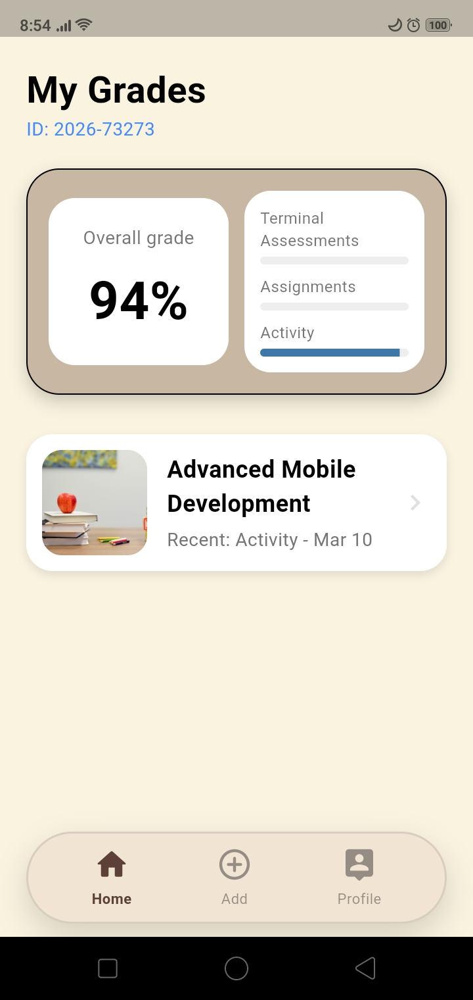

# Student Grade Tracker

<p align="center">
  
</p>

A comprehensive Flutter application designed to help students manage their academic performance by tracking subjects, grades, and activities.

## Description

Student Grade Tracker is a personal academic assistant that allows students to keep a detailed record of their subjects and scores. It provides a dynamic way to calculate averages and visualize progress across different assessments such as terminal exams, assignments, and class activities.

## Features

- **User Authentication**: Secure signup and login system with auto-login capabilities.
- **Subject Management**: Create, update, and delete subjects with custom names and images.
- **Grade Calculation**: Automatically calculates overall grades based on weighted assessments, assignments, and activities.
- **Activity Tracking**: Manage tasks and activities for each subject, including due dates and completion status.
- **Google Classroom Integration**: Sync or interact with Google Classroom data.
- **Profile Customization**: Update profile information and upload a profile image.
- **Internationalization**: Support for multiple languages (Localization).
- **Persistent Storage**: All data is saved locally using SQLite for offline access.
- **Modern UI**: Built with Material Design and includes dynamic theme support.

## Tech Stack

- **Framework**: Flutter
- **Language**: Dart
- **State Management**: Provider
- **Database**: SQFlite (SQLite for Flutter)
- **Local Storage**: Shared Preferences
- **Authentication & APIs**: 
  - Google Sign-In
  - Google Classroom API
  - Firebase Core
- **Other Libraries**:
  - Image Picker (Profile & Subject images)
  - Intl (Formatting and Localization)
  - HTTP (API requests)

## Getting Started

1.  **Clone the repository**
    ```bash
    git clone https://github.com/melio0504/grade-tracker-flutter.git
    ```
2.  **Install dependencies**
    ```bash
    flutter pub get
    ```
3.  **Run the app**
    ```bash
    flutter run
    ```

---
*Developed with ❤️ using Flutter*
